# GameBoy CSS (AI version)

En este repositorio tenemos una **Nintendo GameBoy** hecha con «**vibe-coding en un sólo prompt**» con diferentes modelos LLM de Inteligencia Artificial.

## Prompt utilizado

Se ha utilizado el prompt devuelto por [GitReverse](https://www.gitreverse.com/manzdev/gameboycss) desde el repositorio [ManzDev/gameboycss](https://github.com/manzdev/gameboycss), que contiene una Nintendo GameBoy hecha con HTML/CSS/JS:

```
I want to build a cool web component that looks just like a classic Nintendo GameBoy. The whole thing should be made with HTML, CSS, and JavaScript. It should be styled to look like the original grey handheld, with all the buttons and the screen in the right place.

For the screen itself, let's show a static scene from the old "Terminator 2: Judgment Day" game. When the page loads, I want it to automatically play the theme music from that game, so use a library like HowlerJS for the audio. The buttons and D-pad should be interactive, maybe just making a little click sound when you press them.

Also, please add a small control widget on the side of the page that lets a user tweak some of the visual settings. Let's use WebComponents for this, maybe with LitElement to keep it all nicely contained.
```

## Versiones de GameBoy

| | | |
|:-:|:-:|:-:|
| 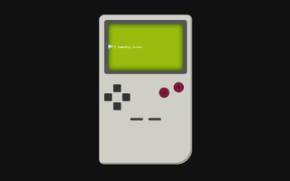<br>[👀 Versión de ChatGPT 5.3](https://manzdev.github.io/gameboy-css-ai/chatgpt-5.3/index.html)<br>[📄 Código fuente](chatgpt-5.3/index.html) | 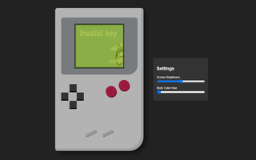<br>[👀 Versión de Google Gemini](https://manzdev.github.io/gameboy-css-ai/gemini/index.html)<br>[📄 Código fuente](gemini/index.html) | 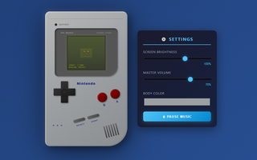<br>[👀 Versión de Kimi k2.5](https://manzdev.github.io/gameboy-css-ai/kimi-k2.5/index.html)<br>[📄 Código fuente](kimi-k2.5/index.html) |
| 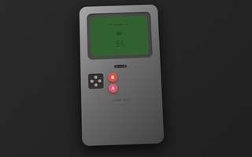<br>[👀 Versión de Claude Haiku 4.5](https://manzdev.github.io/gameboy-css-ai/claude-haiku-4.5/index.html)<br>[📄 Código fuente](claude-haiku-4.5/index.html) | 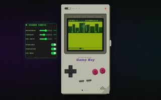<br>[👀 Versión de Claude Sonnet 4.6](https://manzdev.github.io/gameboy-css-ai/claude-sonnet-4.6/index.html)<br>[📄 Código fuente](claude-sonnet-4.6/index.html) | 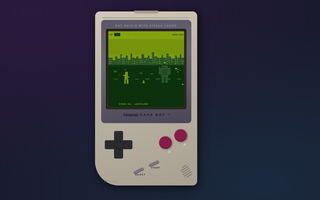<br>[👀 Versión de Claude Opus 4.6](https://manzdev.github.io/gameboy-css-ai/claude-opus-4.6/index.html)<br>[📄 Código fuente](claude-opus-4.6/index.html) |
| 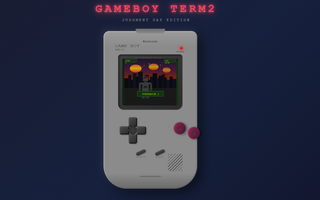<br>[👀 Versión de MiniMax](https://manzdev.github.io/gameboy-css-ai/minimax-agent/index.html)<br>[📄 Código fuente](minimax-agent/index.html) | 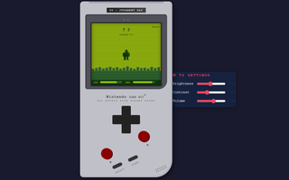<br>[👀 Versión de Qwen 3.6 plus](https://manzdev.github.io/gameboy-css-ai/qwen-3.6-plus/index.html)<br>[📄 Código fuente](qwen-3.6-plus/index.html) | 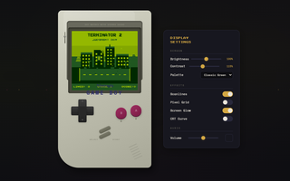<br>[👀 Versión de Z.ai GLM 5 Turbo](https://manzdev.github.io/gameboy-css-ai/glm-5-turbo/index.html)<br>[📄 Código fuente](glm-5-turbo/index.html) |
| 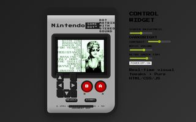<br>[👀 Versión de Grok](https://manzdev.github.io/gameboy-css-ai/grok/index.html)<br>[📄 Código fuente](grok/index.html) | 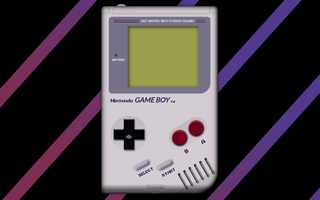<br>[👀 Original ManzDev (No AI)](https://manzdev.github.io/gameboycss/)<br>[📄 Código fuente](https://github.com/manzdev/gameboycss) | 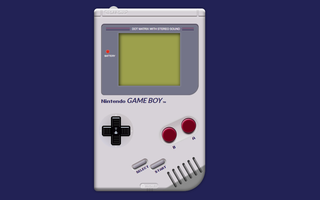<br>[👀 Mejora ManzDev (No AI)](https://manzdev.github.io/twitch-gameboy-css/)<br>[📄 Código fuente](https://github.com/manzdev/twitch-gameboy-css) |

## Créditos

- Idea original de **Mei**.
- Llevada a cabo por [ManzDev](https://manz.dev/).
- Versión de Opus 4.6 gracias a AlinedMooner.
